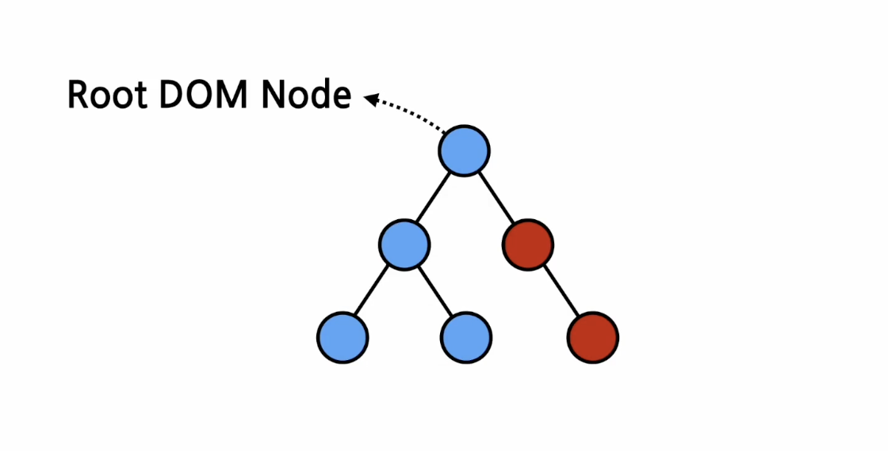

### Contents

- [JSX](#JSX)
- [Element](#Element)

### JSX

- JavaScript와 XML/HTML 코드가 결합된 형태
- JSX를 사용하면 React 내부적으로 createElement라는 함수를 사용해 변환한다.
- `createElement` 함수의 파라미터
  - 
- 장점
  - Injectino Attacks 방어
- 사용법
  - 태그의 속성에 값 넣기
    ```jsx
    // 큰 따옴표 사이에 문자열
    const element = <div tabIndex="0"></div>;
    // 중괄호 사이에 자바스크립트 코드
    const element = </img>;
    ```

### Element

- 리액트 앱을 구성하는 가장 작은 블록
- 리액트 Element는 자바스크립트 객체 형태로 존재
- 컴포넌트 렌더링을 위해 모든 컴포넌트가 createElement 함수를 통해 Element로 변환된다.
- 특징
  - 불변성(immutable): Elements 생성 후에는 children이나 attributes를 바꿀 수 없다.
    - (Component: 붕어빵 틀, Elements: 구운 붕어빵들...)
    - 그럼 화면에 변경된 element를 보여줄 때는 어떻게 할까?
      -> 새로운 element를 만들어 기존 element가 연결되어 있는 부분에 바꿔서 달아주면 된다! (Virtual DOM)
- Element 렌더링하기
  - 루트 div에 React Element 렌더링하기
    - 
    - 
      > **React Element와 DOM Element의 차이** > <br/>React 엘리먼트는 React의 Virtual DOM에 존재하는 것이고 DOM 엘리먼트는 실제 브라우저의 DOM에 존재!
  - 렌더링된 Elements를 업데이트 하기
    - 
    - 함수가 호출될 때마다 기존 엘리먼트를 변경하는 것이 아니라 새로운 엘리먼트를 생성해서 바꿔치기!

### Component와 Props
